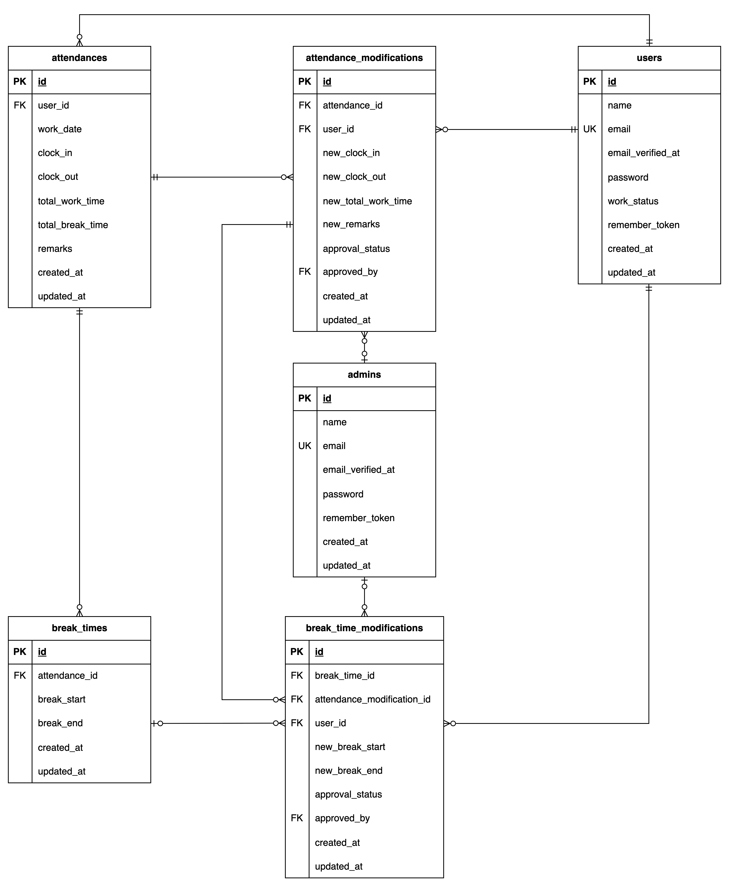

# 勤怠管理アプリ

## 環境構築

### Docker ビルド

1. リポジトリをクローン

```zsh
git clone git@github.com:tkdisk49/worktime-manager.git
```

2. Docker 環境をビルドして起動

```zsh
docker compose up -d --build
```

> M3 チップの Mac で構築しているので、`docker-compose.yml` の「mysql」「phpmyadmin」「mailhog」内に「platform」の項目を追加しています。  
> エラーが発生する場合は、「platform」の項目を削除して再度ビルドを実行してください。

```text
mysql:
    image: mysql:8.0.26
    platform: linux/amd64(この文を削除)

phpmyadmin:
    image: phpmyadmin/phpmyadmin
    platform: linux/amd64(この文を削除)

mailhog:
    image: mailhog/mailhog
    platform: linux/amd64(この文を削除)
```

### Laravel 環境構築

1. PHP コンテナに入る

```zsh
docker compose exec php bash
```

2. 依存パッケージのインストール

```bash
composer install
```

> `composer install` の際にエラーが発生する場合は、`composer update` を実行してから再度インストールしてください。

```bash
composer update
```

3. `env.example`をコピーして`.env`を作成し、環境変数を変更

```env
DB_CONNECTION=mysql
DB_HOST=mysql
DB_PORT=3306
DB_DATABASE=laravel_db
DB_USERNAME=laravel_user
DB_PASSWORD=laravel_pass

MAIL_MAILER=smtp
MAIL_HOST=mailhog
MAIL_PORT=1025
MAIL_USERNAME=null
MAIL_PASSWORD=null
MAIL_ENCRYPTION=null
MAIL_FROM_ADDRESS=noreply@example.com
MAIL_FROM_NAME="${APP_NAME}"
```

4. アプリケーションキーを生成

```bash
php artisan key:generate
```

5. マイグレーションの実行

```bash
php artisan migrate
```

6. シーディングの実行

```bash
php artisan db:seed
```

> 作成されるデータ
>
> - 1 名の管理者
> - 7 名の一般ユーザー
> - ユーザーごとの 2 ヶ月前から昨日までの土日を除く勤怠データ

## PHPUnit テスト

1. `.env.testing.example`をコピーして`.env.testing`を作成
2. テスト用アプリケーションキーの生成

```bash
php artisan key:generate --env=testing
```

3. テストの実行

```bash
php artisan test
```

## メール認証機能(MailHog)

会員登録後や、初めてログインするユーザーはメール認証が必要です。  
開発環境では「認証はこちらから」ボタンを押下すると、[MailHog](http://localhost:8025/)の画面に遷移するようになっているので、認証を完了して下さい。

## テストアカウント

### 一般ユーザー

name: ユーザー  
email: user@example.com  
password: password

> この他に表示用として 6 名のダミーユーザーを作成しています。

### 管理者

name: 管理者  
email: admin@example.com  
password: password

## 補足事項

### テストケースと機能要件の不一致について

テスト内容

- 休憩開始時間が退勤時間より後になっている場合、エラーメッセージが表示される
- 休憩終了時間が退勤時間より後になっている場合、エラーメッセージが表示される

において、期待挙動に

- 出勤時間もしくは退勤時間が不適切な値です

というバリデーションメッセージが表示されるとありますが、機能要件には当該エラーの場合

- 休憩時間が勤務時間外です

と表示させるとなっていますので、機能要件を優先して実装しています。  
この件につきましては、コーチに許可を得ております。

---

### 同一ブラウザでの同時ログイン時の挙動について

- /attendance/{id} (勤怠詳細画面)
- /stamp_correction_request/list (申請一覧画面)

については、一般ユーザーと管理者で同一パスを使用し、認証ガードでコントローラーメソッドと表示を切り替える仕様にしています。  
このため、同一ブラウザ内で一般ユーザーと管理者に同時ログインした場合、最後にログインした guard が有効になり、意図しない挙動になる場合があります。

## 使用技術（実行環境）

- PHP 8.3.11
- Laravel 8.83.29
- MySQL 8.0.26
- Composer
- Docker
- MailHog(メール認証機能)

## ER 図



## URL

- 会員登録画面: http://localhost/register
- 一般ユーザーログイン画面: http://localhost/login
- 管理者ログイン画面: http://localhost/admin/login
- phpMyAdmin: http://localhost:8080/
- MailHog: http://localhost:8025/
